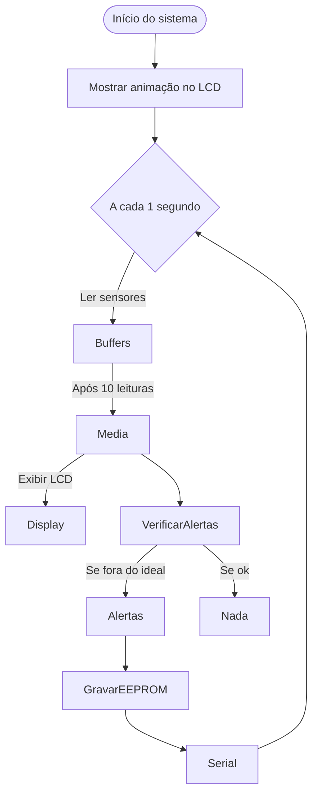

# 🍷 Vinheria Agnello – Sistema de Monitoramento Ambiental com Arduino

Projeto desenvolvido para monitorar **temperatura**, **umidade** e **luminosidade** em tempo real, com **alertas inteligentes**, **armazenamento de dados históricos** e **interface gráfica via LCD**, atendendo aos critérios de conservação ideais para vinhos.

---

## 🎯 Objetivo

Garantir a qualidade da armazenagem dos vinhos através do monitoramento automatizado de três variáveis ambientais críticas:

- 🌡️ **Temperatura**: deve estar entre 20°C e 30°C
- 💧 **Umidade**: entre 30% e 60%
- 💡 **Luminosidade**: até 60% (baixa iluminação recomendada)

---

## 🛠 Funcionalidades do Sistema

### ✅ Leitura e Processamento de Sensores

- **DHT22**: Leitura de temperatura (°C) e umidade (%)
- **LDR**: Leitura da luminosidade (%), calibrada com `map()`
- Leituras coletadas **a cada segundo** e armazenadas em **buffers circulares**

```cpp
float humidity = dht.readHumidity();
float temperature = dht.readTemperature();
int analogValueLum = analogRead(sensorLed);
int percentageLum = map(analogValueLum, 1023, 0, 0, 100);

tempBuffer[bufferIndex] = temperature;
humBuffer[bufferIndex] = humidity;
lumBuffer[bufferIndex] = percentageLum;
bufferIndex++;
```

---

### ✅ Cálculo de Médias e Atualização de Tela

- A cada **10 segundos**:
  - Calcula a **média** das últimas 10 leituras
  - Atualiza o **LCD 16x2** com:
    - Temperatura média  
    - Umidade média  
    - Luminosidade média  
    - Hora atual (RTC)

```cpp
float avgTemp = 0, avgHum = 0, avgLum = 0;
for (int i = 0; i < 10; i++) {
    avgTemp += tempBuffer[i];
    avgHum += humBuffer[i];
    avgLum += lumBuffer[i];
}
avgTemp /= 10;
avgHum /= 10;
avgLum /= 10;

lcd.setCursor(0, 0);
lcd.print("T:"); lcd.print(avgTemp, 1); lcd.print("C H:");
lcd.print(avgHum, 0); lcd.print("%  ");

lcd.setCursor(0, 1);
lcd.print("L:"); lcd.print(avgLum, 0); lcd.print("% ");
lcd.print(now.hour()); lcd.print(":"); lcd.print(now.minute());
```

---

### ✅ Alertas Visuais e Sonoros

- Verificação dos limites:
  - Temperatura fora do ideal → 🔴 LED vermelho + 🔊 buzzer
  - Umidade fora do ideal → 🟡 LED amarelo + 🔊 buzzer
  - Luminosidade acima do ideal → 🟢 LED verde + 🔊 buzzer
- Alertas duram 5 segundos e são registrados via Serial

```cpp
if (avgTemp < trigger_t_min || avgTemp > trigger_t_max) {
    digitalWrite(ledRed, HIGH);
    digitalWrite(buzzer, HIGH);
    Serial.println("ALERTA: Temperatura fora do limite!");
    delay(5000);
    digitalWrite(ledRed, LOW);
    digitalWrite(buzzer, LOW);
}
```

---

### ✅ Armazenamento de Dados

- A cada **5 minutos** ou **ao disparar alerta**, os dados médios são salvos na **EEPROM** junto com o **timestamp** (hora real)
- Cada registro ocupa **9 bytes**:
  - 4 bytes: Unix timestamp  
  - 2 bytes: temperatura ×100  
  - 2 bytes: umidade ×100  
  - 1 byte: luminosidade (%)
- Armazenamento é **circular**, evitando sobreposição descontrolada

```cpp
EEPROM.put(currentAddress, nowUnix);
EEPROM.put(currentAddress + 4, (int)(avgTemp * 100));
EEPROM.put(currentAddress + 6, (int)(avgHum * 100));
EEPROM.put(currentAddress + 8, (int)avgLum);
getNextAddress();
```

---

### ✅ Exportação Serial em CSV

- Comando `"export"` via monitor serial  
- Exporta todos os registros salvos em formato:
  ```
  Timestamp,Data,Hora,Temperatura,Umidade,Luminosidade
  ```

```cpp
if (command == "export") {
    Serial.println("Timestamp,Data,Hora,Temperatura,Umidade,Luminosidade");
    // loop para leitura dos registros da EEPROM e impressão em CSV
}
```

---

### ✅ Animação Personalizada no LCD

- Sequência de **37 quadros** exibe o **logotipo da vinheria animado** ao iniciar o sistema
- Utiliza a função `lcd.createChar()` para desenhar cada parte do logo

```cpp
byte image[8] = {B00000, B00000, B00001, B00000, B00000, B00000, B00000, B00000};
lcd.createChar(0, image);
lcd.setCursor(8, 1);
lcd.write(byte(0));
```

---


---

## 🔌 Componentes Utilizados

| Componente        | Função                                           |
|-------------------|--------------------------------------------------|
| Arduino UNO       | Microcontrolador principal                      |
| DHT22             | Sensor de temperatura e umidade                 |
| LDR               | Sensor de luminosidade                          |
| LCD 16x2 I2C      | Exibição dos dados ambientais e do horário      |
| RTC DS1307        | Relógio em tempo real (com backup de bateria)   |
| EEPROM interna    | Armazenamento persistente dos dados             |
| LEDs (R, Y, G)     | Indicadores visuais de alerta                   |
| Buzzer            | Alerta sonoro                                   |
| Protoboard + jumpers | Montagem dos circuitos                      |

---

## 🖥️ Interface

### LCD 16x2
Exibe a cada 10 segundos:

```
T:25.3C H:58%     
L:42%   14:35     
```

### Serial
Mensagens informativas:
- Alertas disparados
- Dados médios a cada minuto
- Exportação dos logs com o comando `"export"`

---

## 🧠 Lógica de Funcionamento



---

## 🧪 Testes Realizados

- ✅ Sensores testados individualmente
- ✅ Teste de alertas com valores simulados
- ✅ EEPROM preenchida até o limite circular
- ✅ Comando `"export"` retornando todos os registros corretamente
- ✅ RTC sincronizado com horário da compilação

---

## 📁 Estrutura do Projeto

```
VinheriaMonitoramento/
├── vinheria.ino              # Código-fonte completo
├── circuito.png              # Esquema do circuito eletrônico
├── README.md                 # Documentação do projeto
```

---

## 🔗 Simulação

O projeto pode ser simulado online em:  
➡️ [https://wokwi.com](https://wokwi.com)  
> *Sensor DHT22 foi utilizado no lugar do DHT11 por maior precisão e compatibilidade com a plataforma.*

---

## 🚀 Detalhes que Enriquecem o Projeto

- 🎞️ **Animação gráfica com o logo da vinheria no LCD**
- 🧠 **Cálculo de médias por buffer para leituras mais confiáveis**
- 💾 **Registro histórico com hora exata via RTC**
- 📊 **Exportação de dados em CSV para análise externa**
- 🔁 **EEPROM com sistema de armazenamento circular**
- 👨‍💻 **Código modular e bem documentado**

---

## 🔍 Destaque do Código

Abaixo está a lógica que realiza o **registro automático dos dados** na EEPROM a cada 5 minutos ou sempre que ocorre um alerta:

```cpp
if ((millis() - lastEEPROMWrite >= 300000) || alertTriggered) {
    lastEEPROMWrite = millis();

    int tempInt = (int)(avgTemp * 100);
    int humiInt = (int)(avgHum * 100);
    int lumInt = (int)avgLum;

    EEPROM.put(currentAddress, nowUnix);
    EEPROM.put(currentAddress + 4, tempInt);
    EEPROM.put(currentAddress + 6, humiInt);
    EEPROM.put(currentAddress + 8, lumInt);

    getNextAddress();
}
```

**O que essa parte faz:**
- Armazena os dados de temperatura, umidade e luminosidade junto com o horário exato.
- Converte temperatura e umidade em inteiros multiplicando por 100 para ganhar precisão com menos espaço.
- Avança para o próximo endereço com `getNextAddress()`, reiniciando ao chegar no fim da memória.

Esse trecho é essencial para garantir que as **condições ambientais fiquem registradas**, mesmo se o dispositivo for reiniciado.

---

## 🏁 Conclusão

O sistema entrega uma solução completa de monitoramento ambiental para vinhos, com alertas automatizados, interface visual clara e registro inteligente de dados — oferecendo controle total sobre o ambiente de armazenagem e potencial para evoluções futuras como integração web ou automação de refrigeração.

---
